Acceptance Test Data Context
============================

Context
-------

Acceptance test data compatible with the IMPROVER codebase is
stored within this repository: REPO_URL. This acceptance test
data deliberately uses a small spatial area to reduce data
volumes. This page details the spatial context for the data used in
the acceptance tests, so that it is easier for developers to
understand what the acceptance test data, for a particular test,
is designed to represent.

weighted_blending
-----------------

weighted_blending/basic_nonlin/kgo.nc
^^^^^^^^^^^^^^^^^^^^^^^^^^^^^^^^^^^^^

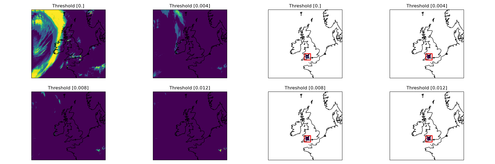

weighted_blending/accum_cycle_blend/ukv_prob_accum_PT3H.nc
^^^^^^^^^^^^^^^^^^^^^^^^^^^^^^^^^^^^^^^^^^^^^^^^^^^^^^^^^^

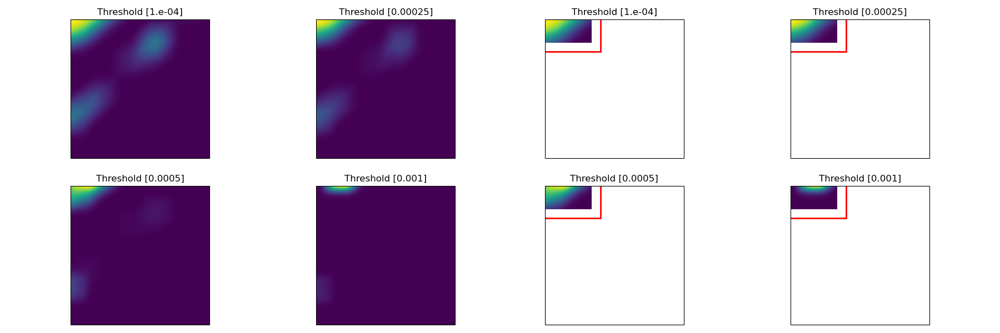

weighted_blending/accum_cycle_blend/kgo.nc
^^^^^^^^^^^^^^^^^^^^^^^^^^^^^^^^^^^^^^^^^^

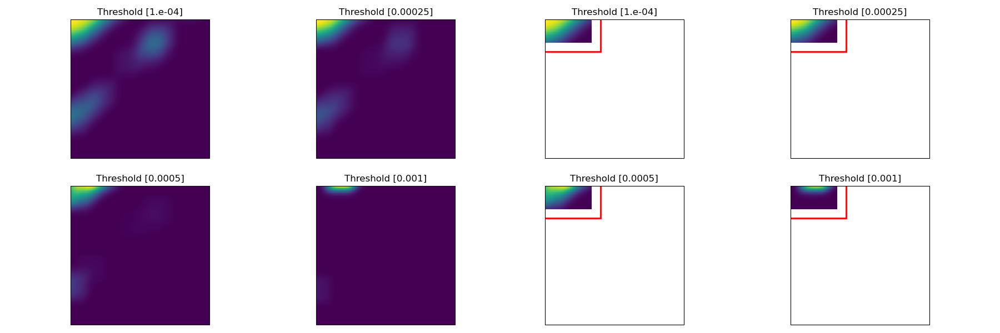

weighted_blending/accum_cycle_blend/ukv_prob_accum_PT4H.nc
^^^^^^^^^^^^^^^^^^^^^^^^^^^^^^^^^^^^^^^^^^^^^^^^^^^^^^^^^^

weighted_blending/percentile_weights_from_dict/enuk_input.nc
^^^^^^^^^^^^^^^^^^^^^^^^^^^^^^^^^^^^^^^^^^^^^^^^^^^^^^^^^^^^

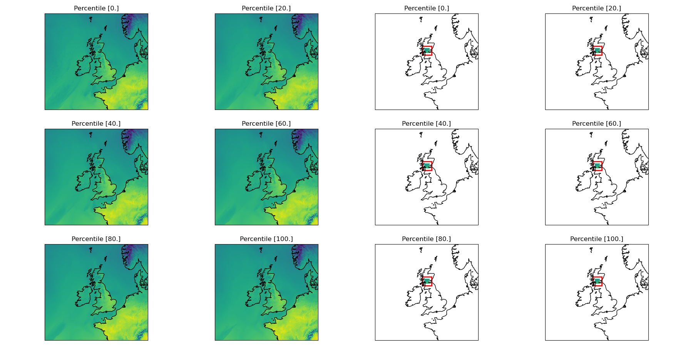

weighted_blending/percentile_weights_from_dict/ukv_input.nc
^^^^^^^^^^^^^^^^^^^^^^^^^^^^^^^^^^^^^^^^^^^^^^^^^^^^^^^^^^^

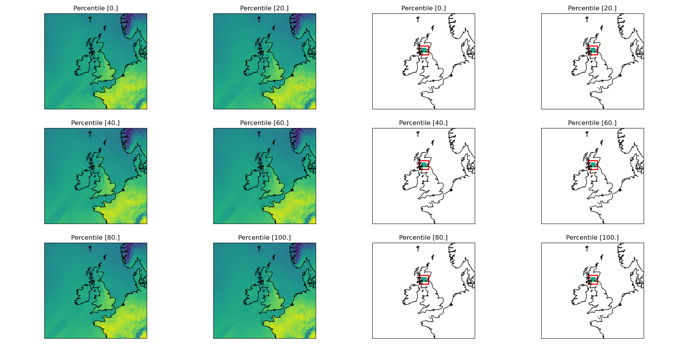

weighted_blending/percentile_weights_from_dict/kgo.nc
^^^^^^^^^^^^^^^^^^^^^^^^^^^^^^^^^^^^^^^^^^^^^^^^^^^^^

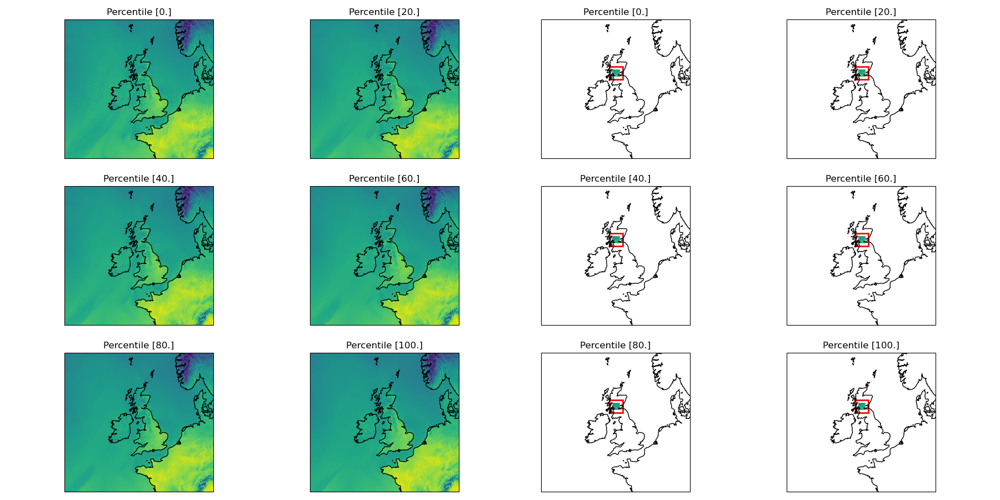

weighted_blending/spatial_weights/kgo/cycle_no_fuzzy.nc
^^^^^^^^^^^^^^^^^^^^^^^^^^^^^^^^^^^^^^^^^^^^^^^^^^^^^^^

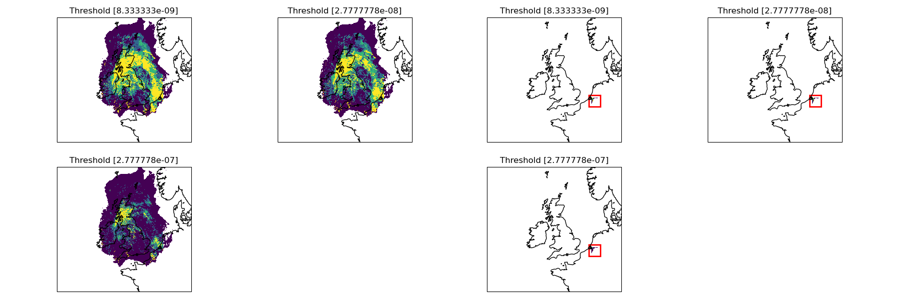

weighted_blending/spatial_weights/kgo/model.nc
^^^^^^^^^^^^^^^^^^^^^^^^^^^^^^^^^^^^^^^^^^^^^^

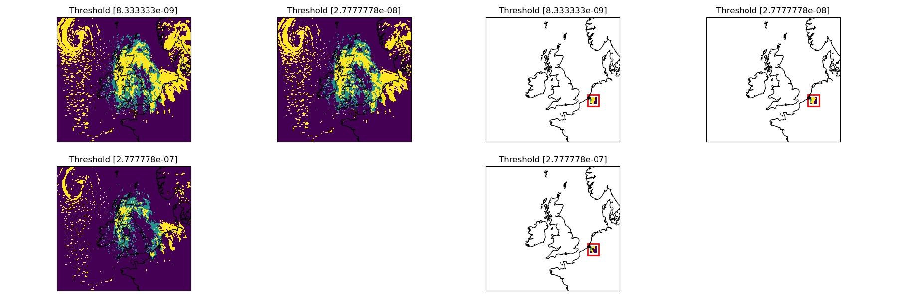

weighted_blending/spatial_weights/kgo/model_no_fuzzy.nc
^^^^^^^^^^^^^^^^^^^^^^^^^^^^^^^^^^^^^^^^^^^^^^^^^^^^^^^

weighted_blending/spatial_weights/kgo/cycle.nc
^^^^^^^^^^^^^^^^^^^^^^^^^^^^^^^^^^^^^^^^^^^^^^

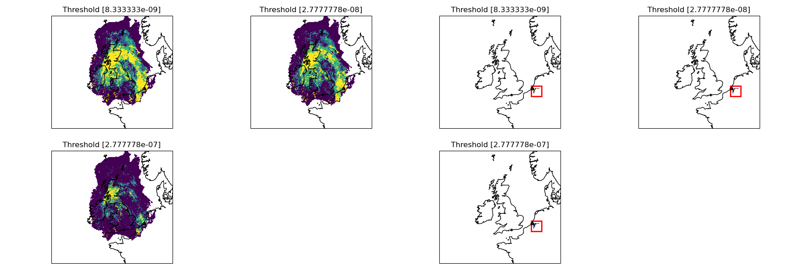

weighted_blending/spatial_weights/nowcast_data/20181129T1000Z-PT0003H00M-lwe_precipitation_rate.nc
^^^^^^^^^^^^^^^^^^^^^^^^^^^^^^^^^^^^^^^^^^^^^^^^^^^^^^^^^^^^^^^^^^^^^^^^^^^^^^^^^^^^^^^^^^^^^^^^^^

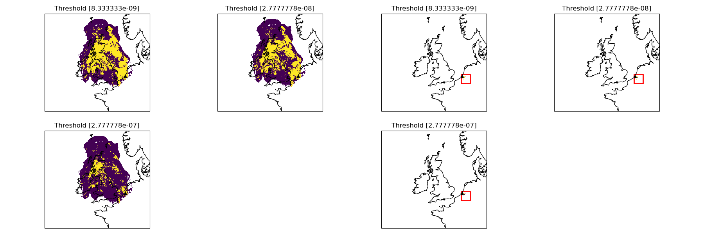

weighted_blending/spatial_weights/nowcast_data/20181129T1000Z-PT0004H00M-lwe_precipitation_rate.nc
^^^^^^^^^^^^^^^^^^^^^^^^^^^^^^^^^^^^^^^^^^^^^^^^^^^^^^^^^^^^^^^^^^^^^^^^^^^^^^^^^^^^^^^^^^^^^^^^^^

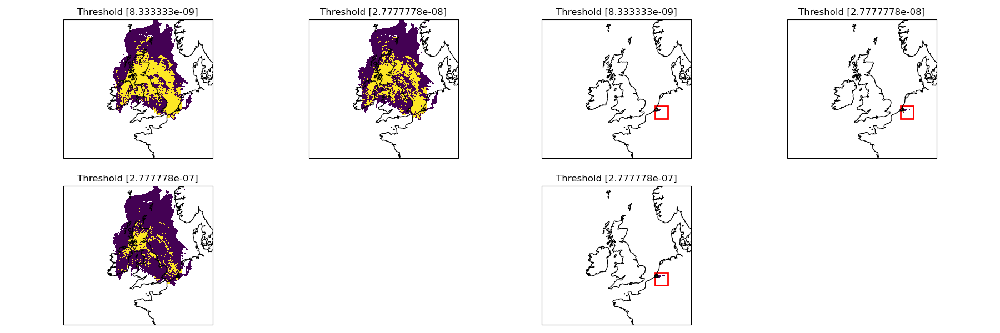

weighted_blending/spatial_weights/nowcast_data/20181129T1000Z-PT0002H00M-lwe_precipitation_rate.nc
^^^^^^^^^^^^^^^^^^^^^^^^^^^^^^^^^^^^^^^^^^^^^^^^^^^^^^^^^^^^^^^^^^^^^^^^^^^^^^^^^^^^^^^^^^^^^^^^^^

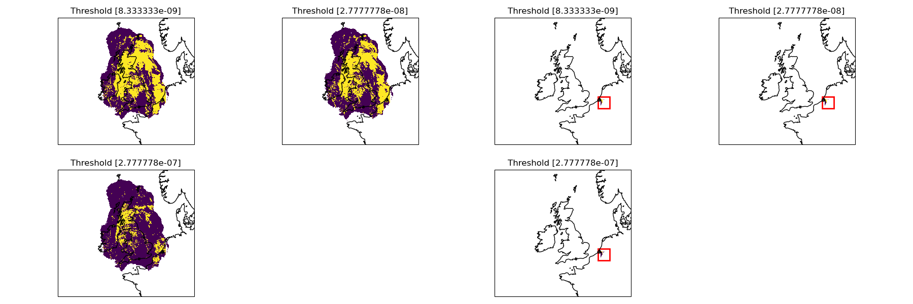

weighted_blending/spatial_weights/ukvx_data/20181129T1000Z-PT0002H00M-lwe_precipitation_rate.nc
^^^^^^^^^^^^^^^^^^^^^^^^^^^^^^^^^^^^^^^^^^^^^^^^^^^^^^^^^^^^^^^^^^^^^^^^^^^^^^^^^^^^^^^^^^^^^^^

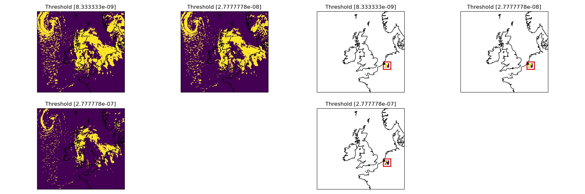

weighted_blending/basic_lin/kgo.nc
^^^^^^^^^^^^^^^^^^^^^^^^^^^^^^^^^^

weighted_blending/basic_lin/multiple_probabilities_rain_2H.nc
^^^^^^^^^^^^^^^^^^^^^^^^^^^^^^^^^^^^^^^^^^^^^^^^^^^^^^^^^^^^^

weighted_blending/basic_lin/multiple_probabilities_rain_3H.nc
^^^^^^^^^^^^^^^^^^^^^^^^^^^^^^^^^^^^^^^^^^^^^^^^^^^^^^^^^^^^^

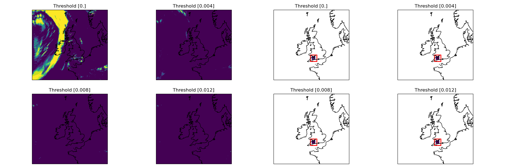

weighted_blending/basic_lin/multiple_probabilities_rain_1H.nc
^^^^^^^^^^^^^^^^^^^^^^^^^^^^^^^^^^^^^^^^^^^^^^^^^^^^^^^^^^^^^

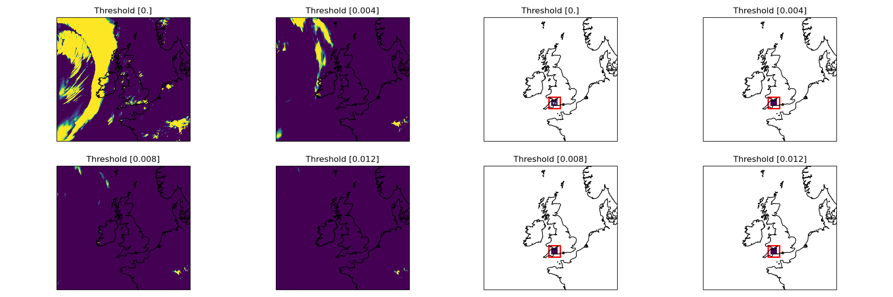

weighted_blending/three_models/kgo.nc
^^^^^^^^^^^^^^^^^^^^^^^^^^^^^^^^^^^^^

weighted_blending/three_models/enukxhrly/20190101T0400Z-PT0004H00M-precip_rate.nc
^^^^^^^^^^^^^^^^^^^^^^^^^^^^^^^^^^^^^^^^^^^^^^^^^^^^^^^^^^^^^^^^^^^^^^^^^^^^^^^^^

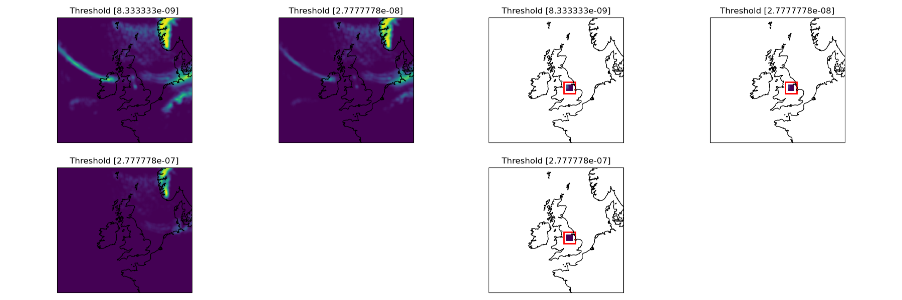

weighted_blending/three_models/ukvx/20190101T0400Z-PT0002H00M-precip_rate.nc
^^^^^^^^^^^^^^^^^^^^^^^^^^^^^^^^^^^^^^^^^^^^^^^^^^^^^^^^^^^^^^^^^^^^^^^^^^^^

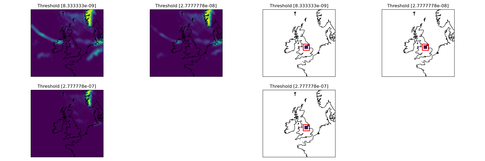

weighted_blending/three_models/nc/20190101T0400Z-PT0001H00M-precip_rate.nc
^^^^^^^^^^^^^^^^^^^^^^^^^^^^^^^^^^^^^^^^^^^^^^^^^^^^^^^^^^^^^^^^^^^^^^^^^^

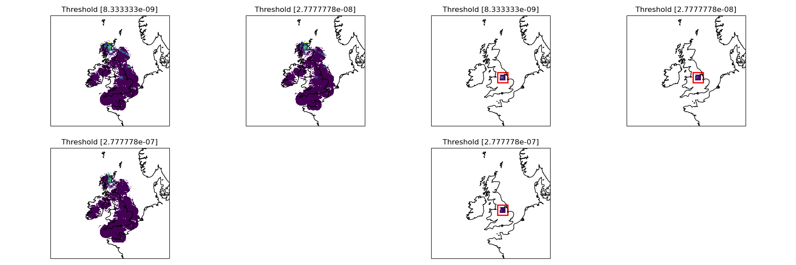

weighted_blending/weights_from_dict/kgo.nc
^^^^^^^^^^^^^^^^^^^^^^^^^^^^^^^^^^^^^^^^^^

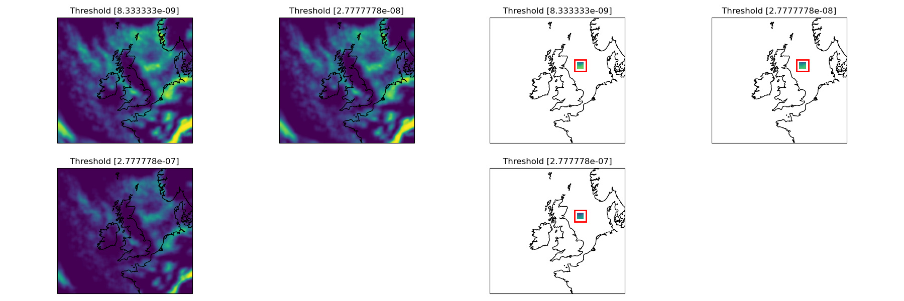

weighted_blending/model/enuk_input.nc
^^^^^^^^^^^^^^^^^^^^^^^^^^^^^^^^^^^^^

.. figure:: ../files/weighted_blending/model/enuk_input.png
   :align: center

weighted_blending/model/ukv_input.nc
^^^^^^^^^^^^^^^^^^^^^^^^^^^^^^^^^^^^

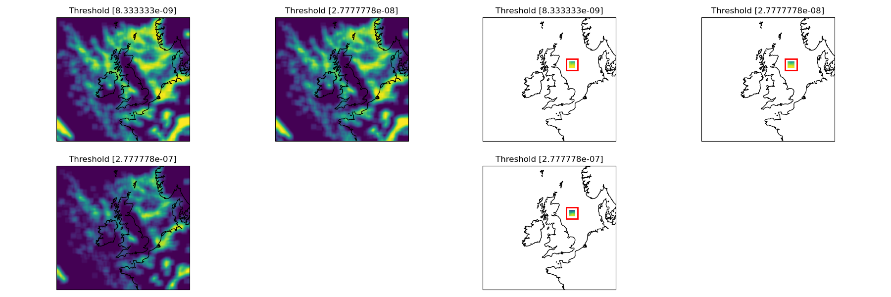

weighted_blending/model/kgo.nc
^^^^^^^^^^^^^^^^^^^^^^^^^^^^^^

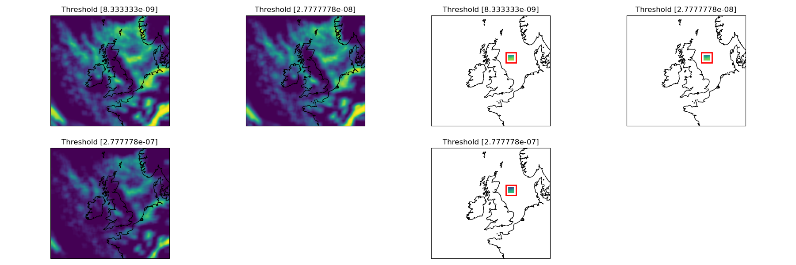

weighted_blending/non_mo_model/non_mo_ens.nc
^^^^^^^^^^^^^^^^^^^^^^^^^^^^^^^^^^^^^^^^^^^^

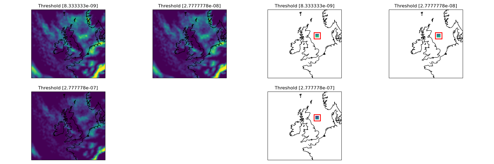

weighted_blending/non_mo_model/kgo.nc
^^^^^^^^^^^^^^^^^^^^^^^^^^^^^^^^^^^^^

weighted_blending/non_mo_model/non_mo_det.nc
^^^^^^^^^^^^^^^^^^^^^^^^^^^^^^^^^^^^^^^^^^^^

weighted_blending/percentiles/input.nc
^^^^^^^^^^^^^^^^^^^^^^^^^^^^^^^^^^^^^^

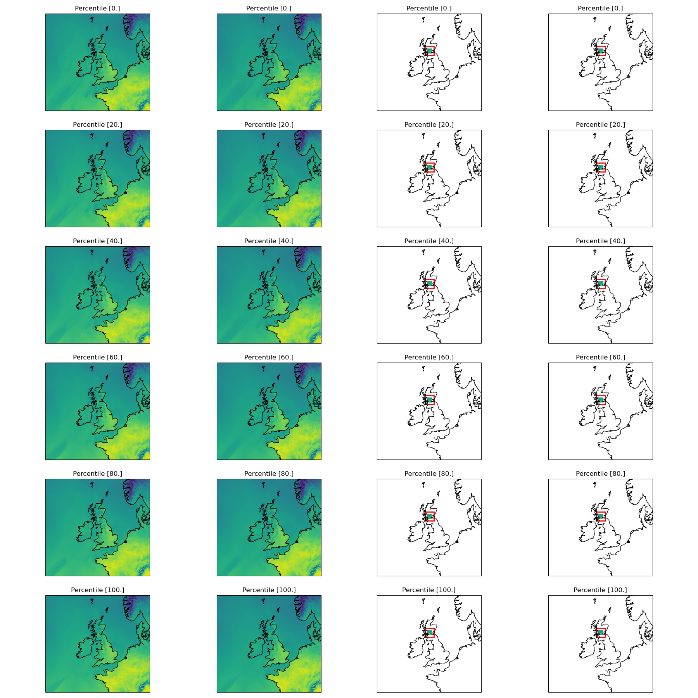

weighted_blending/percentiles/kgo.nc
^^^^^^^^^^^^^^^^^^^^^^^^^^^^^^^^^^^^

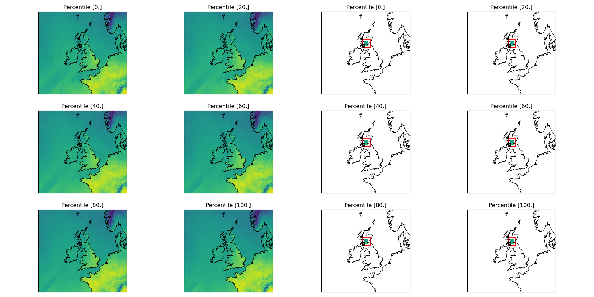
